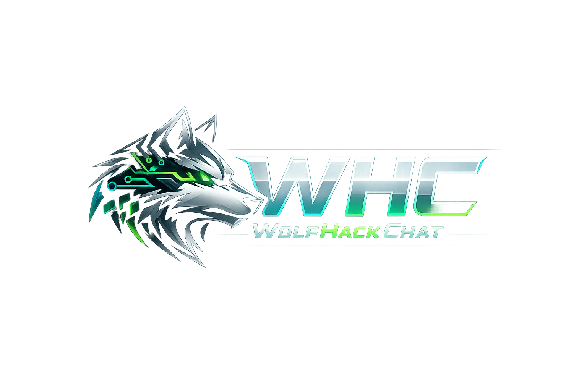

<div align="center">
  
  <h2>WolfHackChat</h2>
  <p><b>Multi-provider AI chat</b> (OpenAI, Gemini, OpenRouter) with <b>local Ollama</b> and <b>USB GGUF</b> import tools — packaged as a fast desktop app.</p>

  <p>
    <a href="#features">Features</a> ·
    <a href="#how-it-works">How it works</a> ·
    <a href="#getting-started">Getting started</a> ·
    <a href="#usage">Usage</a> ·
    <a href="#future-features">Future features</a>
  </p>
</div>

## Marketing definition (what this app is)

**WolfHackChat** is a desktop AI chat workspace designed for developers and power users who want:

- **One chat UI for multiple providers**: switch between OpenAI, Gemini, OpenRouter, or Ollama.
- **Local-first + cloud sync**: settings are stored on your device and can sync to your signed-in workspace.
- **Portable local model workflow**: scan a USB drive for `.gguf` models and register them into Ollama.
- **Productivity tools**: chat history, projects, file attachments, and a “WF Flow” prompt builder for generating code from JSON.

If you want a “ChatGPT-like” app that also supports **Ollama and USB model importing**, this is it.

## Features

- **Multi-provider chat**:
  - **OpenAI** (ChatGPT API)
  - **Google Gemini**
  - **OpenRouter** (model marketplace)
  - **Ollama** (local)
- **Projects + chat history** (sidebar):
  - Create projects
  - Create/delete chats per project
- **Attachments**:
  - Attach **text/code files** (they’re embedded into your prompt)
  - Attach **images** (sent as image data URLs)
- **WF Flow (marketing-friendly)**:
  - Upload a `.json` file → choose a programming language → the app inserts a “generate code from JSON” prompt into your message.
- **USB → GGUF → Ollama tools (Windows)**:
  - Detect removable drives
  - Scan for `.gguf`
  - Run `ollama create <model>` from a Modelfile that references the GGUF
- **Settings & personalization**:
  - Theme (dark / dark-green)
  - Font size
  - “Send on Enter”
  - Rules presets + custom rules (system message behavior)

## How it works

### App architecture

- **UI**: React + Vite (renderer)
- **Desktop shell**: Electron
- **Local settings**: saved in Electron `userData` as `wolfhackchat-settings.json`
- **Cloud sync + auth**: Firebase Authentication + Firestore (workspace/projects/chats)

### Message sending (methods)

1. You pick a **provider** in **Settings** and configure the API key / model (or an Ollama base URL + model).
2. You type a message (optionally attach files/images).
3. The renderer calls the provider send method and appends the assistant reply into the conversation.

### Workspace + sync (methods)

- **Local save**: settings persist on your device.
- **Cloud save**: when you are signed in, the app syncs workspace + settings to Firebase after you pause typing for about a second, and also on explicit Save.

### USB GGUF import (methods)

1. In **USB / GGUF / Ollama**, the app lists **removable drives**.
2. It scans the selected drive for `.gguf` files (depth-limited).
3. When you select a GGUF and choose a model name, it runs:

```bash
ollama create <modelName> -f <generated-modelfile>
```

The Modelfile uses `FROM "<path-to-gguf>"`.

## Getting started

### Requirements

- **Node.js** (LTS recommended)
- **Windows** (USB scanning relies on PowerShell removable volume detection)
- Optional (for local chat & USB import): **Ollama** installed and available on PATH  
  - Install from `https://ollama.com`


## Usage

### 1) Sign in

Open the app and sign in (Firebase Authentication).

### 2) Choose your provider

Go to **Settings**:

- **OpenAI**: set API key + model
- **Gemini**: set API key + model id
- **OpenRouter**: set API key + model slug
- **Ollama**: set base URL + local model name

### 3) Start chatting

- Create a project
- Create a new chat
- Send messages

### 4) Attach files / images

Use the paperclip:

- **Text/code files** are embedded into your prompt inside fenced blocks.
- **Images** are attached as image data.

### 5) Use WF Flow (generate code from JSON)

1. Enable **WF Flow** in **Settings**
2. In the chat composer click the `{ }` button
3. Upload a `.json` file and pick a language
4. WolfHackChat inserts a prompt you can edit and send

### 6) Import a USB GGUF model into Ollama

1. Go to **USB / GGUF / Ollama**
2. Refresh drives → Scan for GGUF → pick a file
3. Choose an Ollama model name
4. Click **Create Ollama model from selected GGUF**
5. Then select that model under **Settings → Ollama**

## Future features

- **Provider streaming**: token-by-token streaming UI for faster perceived latency.
- **Conversation export**: export chat/project to Markdown / JSON.
- **Search**: full-text search across projects and chats.
- **Prompt templates**: reusable templates (code review, bug triage, PR summary, etc.).
- **Model manager**: list installed Ollama models, pull/remove models, show disk usage.
- **Safer secrets**: optional OS keychain/credential vault storage for API keys.
- **Cross-platform USB workflow**: macOS/Linux removable drive detection for GGUF scanning.

## Security notes

- **API keys** are stored locally in Electron `userData` and may sync to your Firebase workspace depending on your configuration and usage.
- Treat your Firebase project as **production-grade**: lock down Firestore rules and review what gets synced.

## License

MIT (see `Licence.txt`).

